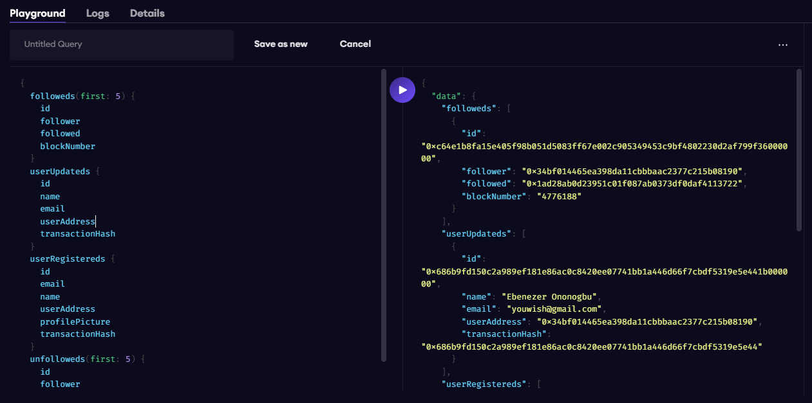

# The Decentralized Blog 👲⛏

### Table of Contents

-   [Description](#description)
-   [Project Breakdown](#project-breakdown)
-   [Authors](#authors)

## Description

This is a subgraph for a smart contract of a mini social media platform enabling users to create accounts, follow other users and make posts that can be accessed and read by other users.

## Project Breakdown

-   [x] [Subgraph](https://thegraph.com/studio/subgraph/decentralized-blog/playground)

    
    
🚀 Sample Subgraph result

## Authors

-   [Ononogbu Ebenezer](https://x.com/ceoCodes) Smart Contract / Subgraph developer

-   [Adeola Blessing](https://x.com/adeolRxxxx) Smart Contract Developer
